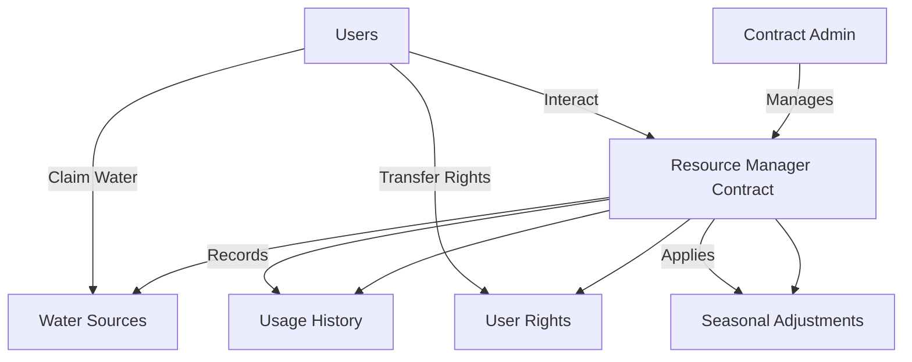

# AquaChain Water Management

AquaChain is a decentralized water management system built on the Stacks blockchain that enables transparent, equitable, and accountable management of shared water resources.

## Overview

AquaChain provides a comprehensive solution for managing water resources through blockchain technology. The system enables:

- Tokenization of water rights
- Automated allocation based on seasonal adjustments
- Transparent tracking of water usage
- Community-based water governance
- Immutable record-keeping of all transactions

The platform serves both individual users and community representatives, ensuring fair access to water resources while maintaining complete transparency and accountability.

## Architecture



The system is built around a central Resource Manager contract that handles:
- Water source registration and management
- User rights allocation and tracking
- Usage history recording
- Seasonal adjustment implementation
- Emergency drought controls

## Contract Documentation

### aqua-resource-manager.clar

The main contract handling all water resource management operations.

#### Core Features
- Water source management
- User rights registration and tracking
- Water allocation claims
- Rights transfer system
- Seasonal adjustment mechanisms
- Drought emergency controls

#### Access Control
- Contract administrator has exclusive rights to:
  - Register water sources
  - Update source levels
  - Register users
  - Manage water rights
  - Set drought emergency status
  - Configure seasonal adjustments

## Getting Started

### Prerequisites
- Clarinet
- Stacks wallet
- Access rights to the contract

### Basic Usage

1. **Register a Water Source**
```clarity
(contract-call? 
    .aqua-resource-manager 
    register-water-source 
    "Lake Alpha" 
    "coordinates:42.123,-71.456" 
    u1000000)
```

2. **Register a User**
```clarity
(contract-call? 
    .aqua-resource-manager 
    register-user 
    'ST1PQHQKV0RJXZFY1DGX8MNSNYVE3VGZJSRTPGZGM 
    u10000 
    (list u1))
```

3. **Claim Water**
```clarity
(contract-call? 
    .aqua-resource-manager 
    claim-water 
    u1 
    u100)
```

## Function Reference

### Administrative Functions

```clarity
(register-water-source (name (string-ascii 50)) (location (string-ascii 100)) (total-capacity uint))
(register-user (user principal) (allocation-base uint) (authorized-sources (list 10 uint)))
(update-source (source-id uint) (new-level uint))
(set-drought-emergency (emergency-active bool))
(set-seasonal-adjustment (season uint) (multiplier uint))
```

### User Functions

```clarity
(claim-water (source-id uint) (amount uint))
(transfer-water-rights (recipient principal) (amount uint))
(get-remaining-allocation (user principal))
(get-user-usage-history (user principal) (start-id uint) (count uint))
```

## Development

### Testing
1. Install Clarinet
2. Run tests:
```bash
clarinet test
```

### Local Development
1. Start Clarinet console:
```bash
clarinet console
```

2. Deploy contracts:
```bash
clarinet deploy
```

## Security Considerations

### Limitations
- Allocation resets must be manually triggered
- Maximum of 10 authorized sources per user
- Policy changes are locked for approximately 8.5 hours after modifications

### Best Practices
- Always verify transaction success
- Monitor allocation limits before transfers
- Check source authorization before claiming water
- Verify drought status before large withdrawals
- Regular auditing of usage history

### Emergency Controls
- Drought emergency mechanism can halt all withdrawals
- Policy lock prevents rapid changes to critical parameters
- Administrator can transfer control in case of key compromise